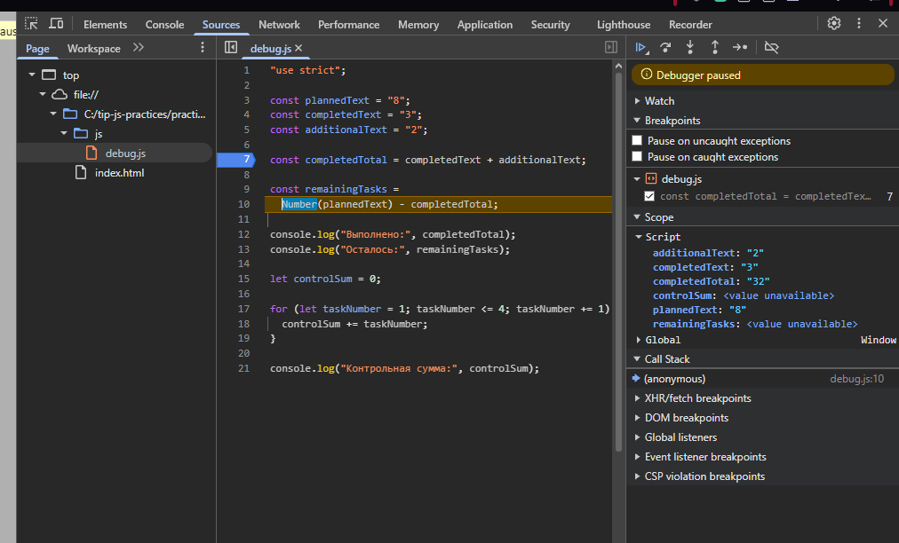

# Отчёт по практической работе № 1

Тема: Подготовка окружения и первые программы на JavaScript

## 1. Автор и окружение

Имя: Горин Геннадий Евгеньевич  
Группа: ЭФБО-06-25  
Вариант: 8  
Операционная система: Windows 10  
Node.js: v24.21.0  
npm: 11.19.0  
Git: git version 2.55.0.windows.5  
Браузер: Opera  

## 2. Запуск

Из корня личного репозитория:

```bash
node practice-01/js/hello.js
node practice-01/js/types.js
node practice-01/js/progress.js
node practice-01/js/plan.js
node practice-01/js/debug.js
```

Для запуска в браузере необходимо открыть:

```text
practice-01/index.html
```

В файле `index.html` через `script` подключается JavaScript-файл, который требуется проверить.

Например:

```html
<script src="./js/hello.js" defer></script>
```

Результат выполнения программы в браузере просматривается через DevTools во вкладке Console.

Перед сдачей в `index.html` подключён файл:

```text
./js/hello.js
```

## 3. Запуск JavaScript в двух средах

Файл `hello.js` был запущен через Node.js и через браузер.

При запуске через Node.js вывод появился в терминале.

При запуске через браузер вывод появился во вкладке Console инструментов разработчика.

Основное различие между двумя средами связано с выражением:

```js
typeof document
```

| Среда | Фактический результат | Причина |
|---|---|---|
| Node.js | `undefined` | В Node.js отсутствует браузерный DOM и глобальный объект `document` |
| Браузер | `object` | В браузере `document` представляет загруженный HTML-документ |

Таким образом, один и тот же JavaScript-файл может выполняться в разных средах, однако набор доступных глобальных объектов отличается.

## 4. Типы данных и преобразования

Для каждого выражения сначала был определён предполагаемый результат, после чего выражение было проверено программно.

| Выражение | Ожидание до запуска | Фактическое значение | Тип результата | Объяснение |
|---|---|---|---|---|
| `"8" + 2` | `"82"` | `"82"` | `string` | Число преобразуется в строку, после чего выполняется конкатенация |
| `"8" - 2` | `6` | `6` | `number` | При вычитании строка `"8"` преобразуется в число |
| `Number("8") + 2` | `10` | `10` | `number` | `Number("8")` явно преобразует строку в число |
| `"12" > "3"` | `false` | `false` | `boolean` | При сравнении двух строк используется строковое сравнение |
| `12 === "12"` | `false` | `false` | `boolean` | Строгое равенство учитывает различие типов |
| `Number("")` | `0` | `0` | `number` | Пустая строка преобразуется в число `0` |
| `Number("text")` | `NaN` | `NaN` | `number` | Строка `"text"` не может быть преобразована в число |
| `Boolean("false")` | `true` | `true` | `boolean` | Любая непустая строка при логическом преобразовании даёт `true` |
| `typeof null` | `"object"` | `"object"` | `string` | `typeof null` возвращает `"object"` из-за исторической особенности JavaScript |
| `typeof NaN` | `"number"` | `"number"` | `string` | `NaN` относится к числовому типу, а результат `typeof` является строкой |

## 5. Сводка выполнения задач

В программе `progress.js` проверяется корректность количества задач, рассчитывается остаток, процент выполнения и текущий статус.

Для варианта 8 используются:

```text
totalTasks = 14
completedTasks = 4
```

Результат индивидуального варианта:

```text
Всего задач: 14
Выполнено: 4
Осталось: 10
Прогресс: 28.6%
Статус: В работе
```

### Проверки

| Входные данные | Ожидаемый результат | Фактический результат | Итог |
|---|---|---|---|
| `14 / 4` | 10 осталось, 28.6%, «В работе» | 10 осталось, 28.6%, «В работе» | Пройдено |
| `12 / 5` | 7 осталось, 41.7%, «В работе» | ЗАПОЛНИТЬ ПОСЛЕ ЗАПУСКА | Заполнить |
| `0 / 0` | `Задач пока нет` | ЗАПОЛНИТЬ ПОСЛЕ ЗАПУСКА | Заполнить |
| `5 / 0` | 5 осталось, 0.0%, «Не начато» | ЗАПОЛНИТЬ ПОСЛЕ ЗАПУСКА | Заполнить |
| `5 / 5` | 0 осталось, 100.0%, «Завершено» | ЗАПОЛНИТЬ ПОСЛЕ ЗАПУСКА | Заполнить |
| `5 / 6` | Ошибка | ЗАПОЛНИТЬ ПОСЛЕ ЗАПУСКА | Заполнить |
| `-1 / 0` | Ошибка | ЗАПОЛНИТЬ ПОСЛЕ ЗАПУСКА | Заполнить |
| `5 / 2.5` | Ошибка | ЗАПОЛНИТЬ ПОСЛЕ ЗАПУСКА | Заполнить |
| `"5" / 2` | Ошибка | ЗАПОЛНИТЬ ПОСЛЕ ЗАПУСКА | Заполнить |
| `1001 / 0` | Ошибка | ЗАПОЛНИТЬ ПОСЛЕ ЗАПУСКА | Заполнить |
| `NaN / 0` | Ошибка | ЗАПОЛНИТЬ ПОСЛЕ ЗАПУСКА | Заполнить |

После выполнения проверок в `progress.js` возвращены значения варианта 8:

```js
const totalTasks = 14;
const completedTasks = 4;
```

## 6. План выполнения задач по дням

В программе `plan.js` определяется количество дней, необходимое для выполнения оставшихся задач.

Для варианта 8 используются:

```text
totalTasks = 14
completedTasks = 4
dailyLimit = 4
```

Остаётся выполнить 10 задач.

Фактический результат:

```text
Осталось задач: 10
День 1: выполнено 4, осталось 6
День 2: выполнено 4, осталось 2
День 3: выполнено 2, осталось 0
Потребуется дней: 3
```

Для расчёта используется цикл `while`.

На каждой итерации определяется количество задач, которое можно выполнить за текущий день. В последний день программа не выполняет больше задач, чем осталось.

### Проверки

| Входные данные | Ожидаемый результат | Фактический результат | Итог |
|---|---|---|---|
| `14 / 4 / 4` | 3 дня: 4, 4 и 2 задачи | 3 дня: 4, 4 и 2 задачи | Пройдено |
| `12 / 5 / 3` | 3 дня, последний день 1 задача | ЗАПОЛНИТЬ ПОСЛЕ ЗАПУСКА | Заполнить |
| `10 / 4 / 3` | 2 дня | ЗАПОЛНИТЬ ПОСЛЕ ЗАПУСКА | Заполнить |
| `5 / 3 / 10` | 1 день, выполнено 2 задачи | ЗАПОЛНИТЬ ПОСЛЕ ЗАПУСКА | Заполнить |
| `5 / 5 / 2` | 0 дней | ЗАПОЛНИТЬ ПОСЛЕ ЗАПУСКА | Заполнить |
| `0 / 0 / 2` | 0 дней | ЗАПОЛНИТЬ ПОСЛЕ ЗАПУСКА | Заполнить |
| `5 / 2 / 0` | Ошибка | ЗАПОЛНИТЬ ПОСЛЕ ЗАПУСКА | Заполнить |
| `5 / 2 / 1.5` | Ошибка | ЗАПОЛНИТЬ ПОСЛЕ ЗАПУСКА | Заполнить |
| `5 / 6 / 2` | Ошибка | ЗАПОЛНИТЬ ПОСЛЕ ЗАПУСКА | Заполнить |
| `5 / 2 / "2"` | Ошибка | ЗАПОЛНИТЬ ПОСЛЕ ЗАПУСКА | Заполнить |
| `5 / 2 / 1001` | Ошибка | ЗАПОЛНИТЬ ПОСЛЕ ЗАПУСКА | Заполнить |

После выполнения проверок в `plan.js` возвращены значения варианта 8:

```js
const totalTasks = 14;
const completedTasks = 4;
const dailyLimit = 4;
```

## 7. Отладка через DevTools

В файле `debug.js` были обнаружены две логические ошибки.

Исходный результат программы:

```text
Выполнено: 32
Осталось: -24
Контрольная сумма: 6
```

После исправления:

```text
Выполнено: 5
Осталось: 3
Контрольная сумма: 10
```

### Найденные ошибки

| Ошибка | Что наблюдалось | Причина | Исправление | Результат после исправления |
|---|---|---|---|---|
| Обработка количества задач | Вместо числа `5` получалась строка `"32"` | `completedText` и `additionalText` являются строками, поэтому оператор `+` выполнял конкатенацию | Использовано явное преобразование через `Number()` | Выполнено 5, осталось 3 |
| Граница цикла | Контрольная сумма была равна `6` вместо `10` | Условие `taskNumber < 4` не включало число 4 | Условие изменено на `taskNumber <= 4` | Контрольная сумма равна 10 |

Для поиска первой ошибки была установлена точка останова на строке вычисления `completedTotal`.

До выполнения строки были исследованы значения:

```text
completedText = "3"
additionalText = "2"
```

Обе переменные имели тип `string`.

После одного шага выполнения значение `completedTotal` становилось равным:

```text
"32"
```

Это позволило определить, что вместо арифметического сложения выполнялась конкатенация строк.

Также была проверена работа цикла. До исправления переменная `taskNumber` принимала значения:

```text
1
2
3
```

После изменения условия на `taskNumber <= 4` в вычисление также включается значение `4`.

### Скриншот отладки



## 8. Индивидуальный вариант

Использован вариант № 8.

Значения варианта:

| Параметр | Значение |
|---|---:|
| `totalTasks` | 14 |
| `completedTasks` | 4 |
| `dailyLimit` | 4 |

Индивидуальные значения использованы в заданиях 3 и 4.

Помимо индивидуального варианта программы проверены на общих обычных, граничных и ошибочных входных данных.

## 9. Дополнительное задание

Не выполнялось.

## 10. Вывод

В ходе практической работы было подготовлено окружение для разработки на JavaScript и изучен запуск программ в Node.js и браузере.

Были рассмотрены основные типы данных JavaScript, явные и неявные преобразования типов, строгие сравнения, условные конструкции и циклы.

В заданиях 3 и 4 была реализована проверка входных данных и обработка обычных, граничных и ошибочных случаев. Для планирования выполнения задач использован цикл `while`.

Также была выполнена отладка программы через DevTools с использованием точки останова и пошагового выполнения.

Наиболее показательной оказалась ошибка сложения строк `"3"` и `"2"`. Без явного преобразования оператор `+` выполнял конкатенацию, из-за чего получалось значение `"32"` вместо числа `5`.

## 11. Самопроверка

- [x] Все обязательные JavaScript-файлы созданы.
- [x] Файлы запускаются через Node.js.
- [x] Выполнен запуск в браузере.
- [x] Для заданий 3 и 4 установлен вариант 8.
- [ ] Выполнены и записаны все фактические проверки задания 3.
- [ ] Выполнены и записаны все фактические проверки задания 4.
- [x] В `debug.js` исправлены обе логические ошибки.
- [ ] Добавлен скриншот точки останова.
- [ ] Указаны реальные версии Node.js, npm и Git.
- [ ] Работа отправлена в GitHub.