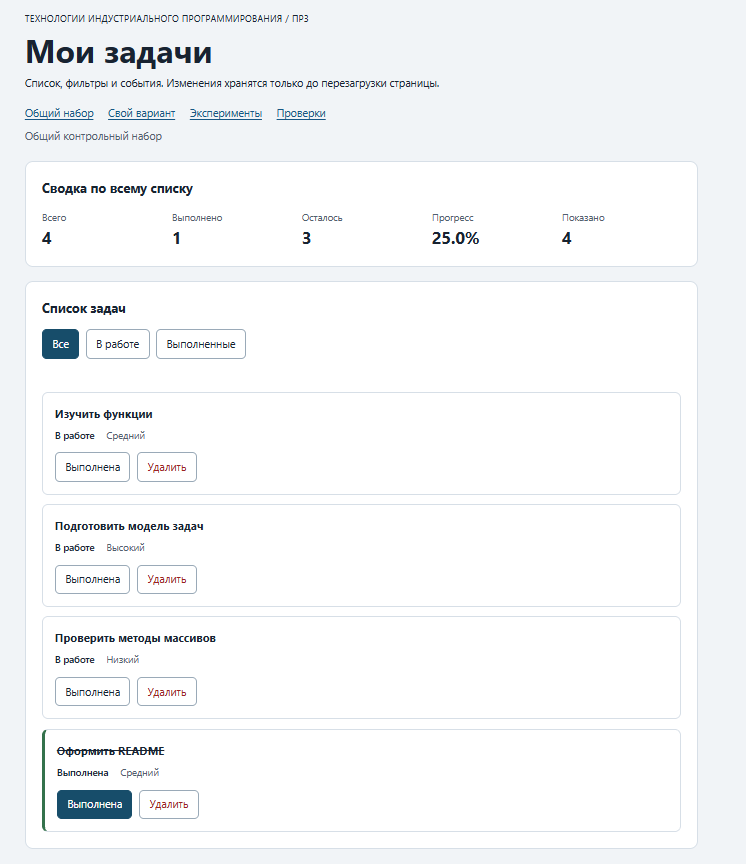

# Практическая работа № 3. Работа с DOM и событиями

## Данные работы

| Поле | Значение |
|---|---|
| Имя | Горин Геннадий Евгеньевич |
| Группа | ЭФБО-06-25 |
| Вариант из ПР2 | 8 |
| Дата выполнения | 06.10.2026 |
| Node.js | v24.21.0 |
| npm | 11.19.0 |
| Git | git version 2.55.0.windows.5 |
| Браузер | Opera |
| Операционная система | Windows 10 |

## Запуск

Рабочая папка: `practice-03` внутри личного репозитория.

```bash
npm run check:service
npm start
```

После запуска доступны страницы:

```text
http://127.0.0.1:5503/
http://127.0.0.1:5503/index.html?dataset=variant
http://127.0.0.1:5503/examples/dom-events.html
http://127.0.0.1:5503/checks.html
```

Устанавливать зависимости через `npm install` не требуется. Остановка сервера: `Ctrl+C`.

## Что перенесено из ПР2

Из ПР2 перенесены проверенные файлы `src/task-service.js` и `src/data.js`.

`task-service.js` содержит операции создания, поиска, изменения статуса, переименования и удаления задач без работы с DOM. `data.js` содержит общий набор `demoTasks`, вариант № 8 и шесть задач варианта.

Повторная проверка сервисного слоя выполнена командой `npm run check:service`: **35 проверок пройдено, 0 ошибок**.

## Эксперименты

| № | До запуска: прогноз | После запуска: результат | Объяснение |
|---:|---|---|---|
| 1. Отсутствующий элемент и коллекция | `querySelector` вернёт `null`, длина пустого `NodeList` будет `0` | Получено `null` и `0` | `querySelector` возвращает `null`, если элемент не найден. `querySelectorAll` возвращает коллекцию, даже если она пустая. |
| 2. dataset и числовой id | `dataset.taskId` будет строкой `"23"`, после `Number` получится число `23` | До преобразования: `"23"`, тип `string`; после: `23`, тип `number` | Значения `data-*` читаются как строки, поэтому id явно преобразуется в число. |
| 3. Статический NodeList | Сохранённый `initialItems` останется длины `1`, новый запрос увидит добавленные элементы | После двух нажатий старый `NodeList` имеет длину `1`, новый `querySelectorAll` — `3` | `querySelectorAll` возвращает статический снимок. |
| 4. Строка с HTML-разметкой | Теги будут показаны обычным текстом | Заголовок стал `<strong>Это текст, а не HTML</strong>`, элемент `strong` не создан | Использован `textContent`, поэтому строка не интерпретируется как HTML. |
| 5. Распространение события | При клике по вложенному `span` сработает захват контейнера, затем обработчик кнопки и всплытие контейнера | `phase=1 target=lab-label currentTarget=lab-card`; затем `phase=3 target=lab-label currentTarget=lab-button`; затем `phase=3 target=lab-label currentTarget=lab-card` | `event.target` остаётся исходным `span`, а `event.currentTarget` соответствует текущему обработчику. |

Обработчик контейнера получает нажатие по вложенному элементу благодаря всплытию. Поэтому в основном приложении кнопка определяется через `event.target.closest("button[data-action]")`.

## Организация кода

- `src/task-service.js` — прикладная логика ПР2, без DOM.
- `src/task-selectors.js` — вычисление видимой выборки для фильтров `all`, `pending`, `completed`.
- `src/task-view.js` — создание карточек, отрисовка списка, сводки и пустого состояния.
- `src/main.js` — текущее состояние, делегированные обработчики, изменение фильтра и вызов сервисного слоя.

Полный актуальный список хранится в `currentTasks`, выбранный фильтр — в `currentFilter`. Сводка вычисляется функцией `getTaskStats` из `task-service.js`.

## Общий сценарий

| Шаг | Видимые id | Всего | Выполнено | Осталось | Прогресс | Показано | Сообщение | Совпало с ожиданием |
|---:|---|---:|---:|---:|---:|---:|---|---|
| 0 | `[1, 4, 7, 10]` | 4 | 2 | 2 | `50.0%` | 4 | — | Да |
| 1 | `[4, 7]` | 4 | 2 | 2 | `50.0%` | 2 | — | Да |
| 2 | `[7]` | 4 | 3 | 1 | `75.0%` | 1 | — | Да |
| 3 | `[1, 4, 7, 10]` | 4 | 3 | 1 | `75.0%` | 4 | — | Да |
| 4 | `[1, 4, 10]` | 3 | 3 | 0 | `100.0%` | 3 | — | Да |
| 5 | `[]` | 3 | 3 | 0 | `100.0%` | 0 | `Нет задач по выбранному фильтру.` | Да |
| 6 | `[1, 4, 10]` | 3 | 2 | 1 | `66.7%` | 3 | — | Да |
| 7 | `[]` | 0 | 0 | 0 | `0.0%` | 0 | `Список задач пуст.` | Да |

После перезагрузки возвращается исходный набор `[1, 4, 7, 10]` со сводкой `4 / 2 / 2 / 50.0%`. Сохранение между перезагрузками в ПР3 не выполняется.

## Индивидуальный вариант

**Вариант 8 — «Оформление технической документации».**

Исходные задачи:

| id | Название | Статус | Приоритет |
|---:|---|---|---|
| 11 | Собрать требования к документации | выполнена | high |
| 23 | Подготовить структуру руководства | выполнена | medium |
| 37 | Описать установку проекта | выполнена | low |
| 41 | Добавить примеры использования | в работе | high |
| 58 | Проверить терминологию | в работе | medium |
| 64 | Оформить список изменений | в работе | low |

По сценарию переключён статус задачи `23`, затем удалена задача `37`.

| Этап | Всего | Выполнено | Осталось | Прогресс | Видимые id |
|---|---:|---:|---:|---:|---|
| До действий | 6 | 3 | 3 | `50.0%` | `[11, 23, 37, 41, 58, 64]` |
| После переключения 23 | 6 | 2 | 4 | `33.3%` | `[11, 23, 37, 41, 58, 64]` |
| После удаления 37 | 5 | 1 | 4 | `20.0%` | `[11, 23, 41, 58, 64]` |
| Итог, фильтр «В работе» | 5 | 1 | 4 | `20.0%` | `[23, 41, 58, 64]` |
| Итог, фильтр «Выполненные» | 5 | 1 | 4 | `20.0%` | `[11]` |

Итоговый прогресс варианта равен `20.0%`.

## Протокол проверки сервиса

```text
> tip-js-practice-03@1.0.0 check:service
> node checks/service.checks.js

OK: 01. Создание задачи с явным приоритетом
OK: 02. Приоритет по умолчанию
OK: 03. Удаление краевых пробелов без изменения внутренних
OK: 04. Граничные длины названия и положительный безопасный id
OK: 05. Некорректные названия при создании
OK: 06. Некорректные идентификаторы при создании
OK: 07. Все допустимые приоритеты и отклонение недопустимых
OK: 08. Каждый вызов createTask возвращает новый объект
OK: 09. Поиск по id, а не по индексу
OK: 10. Отсутствующая задача и пустой массив при поиске
OK: 11. Поиск не преобразует строковый id в число
OK: 12. Получение невыполненных задач
OK: 13. Пустой список, все выполнены и все не выполнены
OK: 14. Названия в исходном порядке и пустой список
OK: 15. Сводка по общему набору
OK: 16. Сводка по пустому списку
OK: 17. Сводка: ничего не выполнено и выполнено всё
OK: 18. Процент остаётся числом без предварительного округления
OK: 19. Добавление в конец без изменения входного массива
OK: 20. Добавление в пустой список с приоритетом по умолчанию
OK: 21. Повторяющийся id отклоняется
OK: 22. Добавление не обходит проверки createTask
OK: 23. Изменение completed в обе стороны
OK: 24. completed принимает только boolean
OK: 25. Некорректный или отсутствующий id при изменении статуса
OK: 26. Повторная установка статуса создаёт новый результат
OK: 27. Переименование сохраняет остальные поля
OK: 28. Проверки названия при переименовании
OK: 29. Некорректный или отсутствующий id при переименовании
OK: 30. Удаление по id с сохранением порядка
OK: 31. Удаление единственной записи
OK: 32. Некорректный, отсутствующий id и удаление из пустого списка
OK: 33. Входные объекты не изменяются ни одной операцией
OK: 34. Общий сценарий и все промежуточные сводки
OK: 35. Работа с другим набором, без зависимости от demoTasks

Проверок пройдено: 35; не пройдено: 0.
```

## Протокол браузерных проверок

```text
OK: Фильтр all возвращает новый массив в исходном порядке
OK: Фильтр pending выбирает невыполненные задачи
OK: Фильтр completed выбирает выполненные задачи
OK: Все три фильтра работают с пустым списком
OK: Фильтрация не меняет входные записи и их порядок
OK: Карточка — li.task-card с числовым id в dataset
OK: Статус невыполненной карточки и aria-pressed согласованы
OK: Статус выполненной карточки и aria-pressed согласованы
OK: В карточке две обычные кнопки с вложенными подписями
OK: Все приоритеты отображаются по установленному словарю
OK: Название с разметкой отображается текстом
OK: Отрисовка списка создаёт карточки в исходном порядке
OK: Повторная отрисовка не накапливает карточки
OK: Контейнер списка и его обработчик сохраняются
OK: Отрисовка пустого массива очищает прежние карточки
OK: Сводка считается по всему списку, отдельно выводится Показано
OK: Пустая сводка не содержит NaN и Infinity
OK: Сообщение для полностью пустого списка
OK: Сообщение для пустого результата фильтра
OK: Появление карточек скрывает прежнее пустое состояние
OK: Приложение: начальный набор и сводка
OK: Приложение: фильтр срабатывает по клику на вложенный span
OK: Приложение: активный фильтр отмечен классом и aria-pressed
OK: Приложение: фильтрация не удаляет скрытые задачи
OK: Приложение: переключение по id, а не индексу массива
OK: Приложение: выполненная задача исчезает из фильтра В работе
OK: Приложение: удаление изменяет данные, а не только DOM
OK: Приложение: клик по названию не изменяет данные
OK: Приложение: после перерисовок одно нажатие — одно изменение
OK: Приложение: удаление всех записей и нулевая сводка
OK: Приложение: нет совпадений — не то же самое, что нет задач
OK: Приложение: неизвестный числовой id не меняет данные
OK: Приложение: id 4abc не превращается в 4
OK: Приложение: неизвестное действие игнорируется
OK: Приложение: после изменения сохраняется клавиатурный фокус
OK: Приложение: новая загрузка возвращает исходное состояние

Всего: 36. Пройдено: 36. Ошибок: 0.
```

## Собственные проверки

| № | Исходное состояние и действия | Ожидаемый результат | Фактический результат | Итог |
|---:|---|---|---|---|
| 1 | Создать карточку с названием длиной 100 символов | Название полностью выводится как текст | Выведено 100 символов без создания HTML-элементов внутри названия | Пройдено |
| 2 | Несколько раз переключить фильтры, затем один раз переключить `id = 4` | Обработчики не накапливаются; выполняется одно изменение | Сводка стала `4 / 3 / 1 / 75.0%`, одно нажатие дало одно изменение | Пройдено |
| 3 | Через DevTools заменить `data-task-id` задачи 4 на `4abc` и нажать кнопку статуса | Значение отклоняется, данные сохраняются | Показано сообщение о некорректном id, сводка осталась `4 / 2 / 2 / 50.0%` | Пройдено |

Первый случай является граничным, второй проверяет событие и повторную отрисовку, третий — ошибочное значение на границе DOM и прикладной логики.

## Отладка и клавиатура

Точка останова устанавливалась в `handleTaskListClick` на строке:

```js
const rawId = card.dataset.taskId;
```

При нажатии на вложенный текст кнопки задачи `id = 4` наблюдаются:

```text
event.target        -> span.action-label
event.currentTarget -> ul#task-list
dataset.taskId      -> "4" (string)
id                  -> 4 (number)
action              -> "toggle"
найденная задача    -> id 4, completed false
результат сервиса   -> ok: true, новый массив с completed true у id 4
```

Для `data-task-id="777"` выводится сообщение `Задача с id 777 не найдена`, состояние не изменяется. Для `data-task-id="4abc"` выводится сообщение о некорректном идентификаторе до вызова сервиса.

Кнопки доступны через `Tab`, `Enter` и `Space`. После изменения статуса фокус возвращается на действие той же задачи. Если карточка исчезает из текущего фильтра или удаляется, фокус переносится на активную кнопку фильтра.

## Вид приложения



## Дополнительное задание

Дополнительное задание не выполнялось.

## Вывод

В практической работе данные и функции ПР2 были связаны с браузерным интерфейсом. Реализованы DOM-карточки, повторная отрисовка списка, сводка, фильтры, изменение статуса и удаление задач.

Для действий используется делегирование событий: один обработчик назначен контейнеру, а нужная кнопка определяется через `closest`. Идентификатор читается из `dataset`, преобразуется в число и проверяется перед передачей в сервисный слой.

DOM является представлением состояния, а не самим состоянием. Поэтому операции сначала формируют новый `currentTasks` через функции сервисного слоя, после чего интерфейс перерисовывается из актуального массива.
